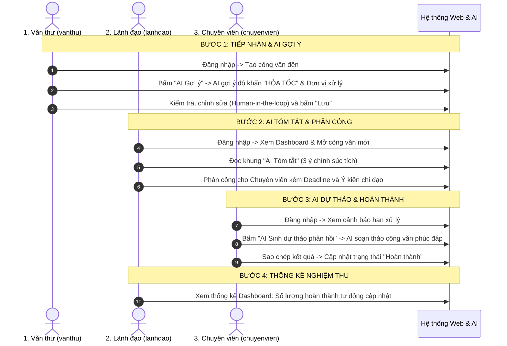

# Skill: Biên Soạn Tài Liệu Hướng Dẫn Sử Dụng & Tương Tác AI (AI User Guide & Manual)

## 1. Mục tiêu và Phạm vi Tài liệu

Skill này định nghĩa cấu trúc, văn phong và quy chuẩn biên soạn tài liệu hướng dẫn sử dụng (User Manual / Operations Guide) phục vụ giai đoạn **Báo cáo Cuối kỳ (Final Capstone Report)** và **Thuyết minh Nghiệm thu** đề tài môn học:
> **"Hệ thống quản lý công văn và văn bản nội bộ có tích hợp AI"**

### Nguyên tắc cốt lõi (Bám sát `role.md`):
- **Phân tách rõ ràng theo 3 vai trò (RBAC)**: Văn thư (`CLERK`), Lãnh đạo (`LEADER`), Chuyên viên (`SPECIALIST`). Mỗi vai trò chỉ thấy và thao tác đúng chức năng được phép.
- **Văn phong hành chính, rõ ràng, dễ hiểu**: Sử dụng ngôn ngữ chuẩn mực hành chính Việt Nam, hướng dẫn từng bước (Step-by-step) có minh họa trực quan.
- **Tập trung vào nguyên lý AI Human-in-the-loop**: Nhấn mạnh AI chỉ đóng vai trò trợ lý đề xuất; người dùng luôn là chủ thể kiểm tra, tinh chỉnh và phê duyệt cuối cùng.
- **Thực tế & Chống Over-engineering**: Cung cấp tài khoản mẫu (Seed data), kịch bản demo 5 phút súc tích để bảo vệ đồ án trơn tru trước hội đồng chấm thi.

---

## 2. Nguyên tắc Hướng Dẫn Tương Tác với AI (AI Interaction Guidelines)

Khi biên soạn hướng dẫn cho các tính năng tích hợp AI, tài liệu bắt buộc phải làm rõ 3 nguyên tắc an toàn:

### 2.1. Bản chất Trợ lý (Assistant, Not Decision Maker)
* AI không có thẩm quyền ban hành hay phát hành văn bản tự động.
* Mọi kết quả do AI sinh ra (Tóm tắt, Phân loại, Độ khẩn, Dự thảo phản hồi) chỉ mang tính chất **Gợi ý (Recommendation)**.

### 2.2. Kiểm duyệt bởi Con người (Human-in-the-loop)
* **Gợi ý phân loại & Độ khẩn (FR12)**: Người dùng xem trước, có quyền bấm chọn lại phòng ban hoặc thay đổi độ khẩn cấp trước khi bấm "Lưu công văn".
* **Dự thảo phản hồi (FR12)**: Chuyên viên sử dụng nội dung do AI tạo ra làm khung sườn, bắt buộc phải đọc lại, biên tập, bổ sung thông tin thực tế và chỉnh sửa trước khi sao chép/gửi báo cáo.

### 2.3. Chống Bịa Thông Tin (Anti-Hallucination) & Cơ chế Dự phòng (Fallback)
* Hướng dẫn người dùng cách nhận diện: Nếu tài liệu gốc không có số liệu (như kinh phí, thời gian), AI được huấn luyện sẽ trả lời "Văn bản không đề cập" chứ không tự ý bịa đặt.
* Khi hệ thống mất kết nối internet hoặc API Key AI hết hạn, hệ thống tự động kích hoạt **Bộ phân tích dự phòng (Resilient Smart Mock Heuristics)**, đảm bảo quá trình thao tác và demo không bao giờ bị gián đoạn hay phát sinh lỗi treo màn hình.

---

## 3. Cấu Trúc Khung Chuẩn của Tài Liệu Hướng Dẫn (Document Structure)

Một bộ tài liệu hướng dẫn sử dụng hoàn chỉnh cần bao gồm 5 phần chính sau:

### PHẦN I: THÔNG TIN CHUNG & TÀI KHOẢN MẪU (GETTING STARTED)
Cung cấp thông tin môi trường và các tài khoản demo sẵn có trong cơ sở dữ liệu:

| Vai trò | Tên đăng nhập | Mật khẩu | Phạm vi quyền hạn chính |
| :--- | :--- | :--- | :--- |
| **Văn thư** | `vanthu` | `123456` | Tiếp nhận công văn đến, AI bóc tách thông tin, phát hành công văn đi, theo dõi sổ công văn, upload tệp. |
| **Lãnh đạo** | `lanhdao` | `123456` | Xem Dashboard tổng quan, đọc tóm tắt AI, phân công văn bản cho Chuyên viên, chỉ đạo và gia hạn xử lý. |
| **Chuyên viên** | `chuyenvien` | `123456` | Tiếp nhận nhiệm vụ được giao, xem văn bản đính kèm, dùng AI sinh dự thảo phúc đáp, cập nhật tiến độ hoàn thành. |

---

### PHẦN II: HƯỚNG DẪN KHỞI CHẠY HỆ THỐNG (QUICK START)
Hướng dẫn ngắn gọn 3 bước để khởi động dự án trên máy chấm thi:
1. **Khởi động Backend (FastAPI)**:
   ```bash
   cd backend
   py -m uvicorn app.main:app --reload --port 8000
   ```
   *Kiểm tra Swagger API tại:* `http://127.0.0.1:8000/docs`
2. **Khởi động Frontend (React / Vite)**:
   ```bash
   cd frontend
   npm run dev
   ```
   *Truy cập ứng dụng tại:* `http://localhost:3000`

---

### PHẦN III: HƯỚNG DẪN CHI TIẾT THEO VAI TRÒ (ROLE-BASED MANUAL)

#### 1. Dành cho Văn thư (Role: `CLERK`)
* **Bước 1: Đăng nhập**: Chọn thẻ đăng nhập nhanh "Văn thư" hoặc nhập `vanthu / 123456`.
* **Bước 2: Tiếp nhận công văn đến (FR3, FR5)**:
  * Nhấp **"+ Thêm mới văn bản"** trên menu trái.
  * Chọn loại: **"Công văn đến"**.
  * Bấm nút **"Nạp dữ liệu mẫu để thử nghiệm"** (hoặc tự nhập số hiệu, trích yếu, cơ quan gửi, đính kèm tệp PDF).
* **Bước 3: Sử dụng AI Gợi ý phân loại & Độ khẩn (FR12)**:
  * Nhấp nút **"🤖 AI Phân tích & Gợi ý"**.
  * Quan sát AI tự động đề xuất: Phòng ban xử lý phù hợp và Mức độ ưu tiên (`HOA_TOC` / `THUONG`).
  * *Lưu ý:* Kiểm tra lại thông tin, chỉnh sửa nếu cần và nhấp **"Lưu công văn"**.
* **Bước 4: Quản lý công văn đi & Tra cứu (FR4, FR8)**:
  * Chuyển tab để xem danh sách Công văn đi, sử dụng thanh tìm kiếm đa tiêu chí theo số hiệu hoặc từ khóa trích yếu.

#### 2. Dành cho Lãnh đạo (Role: `LEADER`)
* **Bước 1: Giám sát Dashboard điều hành (FR10)**:
  * Đăng nhập tài khoản `lanhdao`.
  * Xem 4 thẻ thống kê: Tổng công văn, Đang xử lý, Quá hạn, và Tỷ lệ văn bản theo đơn vị tiếp nhận.
* **Bước 2: Xem chi tiết & Sử dụng AI Tóm tắt (FR11)**:
  * Chọn một công văn có nội dung dài trong bảng danh sách.
  * Trong màn hình chi tiết, quan sát khung **"AI Tóm tắt nội dung"**.
  * Đọc nhanh 3-5 ý chính được cô đọng bằng văn phong hành chính súc tích mà không cần đọc hết tài liệu gốc.
* **Bước 3: Phân công nhiệm vụ & Đặt hạn xử lý (FR6, FR9)**:
  * Nhấp **"Phân công xử lý"**.
  * Chọn Chuyên viên phụ trách (ví dụ: `Nguyễn Văn Chuyên Viên`).
  * Chọn **Hạn xử lý (Deadline)** và nhập **Ý kiến chỉ đạo**.
  * Bấm **"Xác nhận phân công"** -> Hệ thống tự động chuyển trạng thái văn bản sang `Đang xử lý (IN_PROGRESS)`.

#### 3. Dành cho Chuyên viên (Role: `SPECIALIST`)
* **Bước 1: Tiếp nhận việc được giao (FR6, FR7)**:
  * Đăng nhập tài khoản `chuyenvien`.
  * Truy cập trang **"Nhiệm vụ của tôi"**. Các công văn sắp hết hạn được gắn thẻ màu cam, quá hạn gắn thẻ màu đỏ.
  * Bấm chọn văn bản để xem ý kiến chỉ đạo từ Lãnh đạo.
* **Bước 2: Sử dụng AI Sinh dự thảo phản hồi (FR12 - Human-in-the-loop)**:
  * Nhấp nút **"🤖 AI Sinh dự thảo phản hồi"**.
  * Nhập yêu cầu phản hồi (ví dụ: *"Đồng ý tham gia, cử 02 cán bộ phụ trách"*).
  * AI tạo khung công văn phúc đáp hoàn chỉnh: Quốc hiệu, Tiêu ngữ, Kính gửi, Căn cứ và Nội dung phúc đáp.
  * Chuyên viên nhấp **"Sao chép nội dung"** hoặc biên tập trực tiếp trước khi gửi trình ký.
* **Bước 3: Cập nhật trạng thái tiến độ (FR7)**:
  * Chuyển trạng thái từ `Đang xử lý` sang `Hoàn thành (COMPLETED)`.
  * Ghi nhận thời gian hoàn tất vào nhật ký hệ thống.

---

### PHẦN IV: KỊCH BẢN DEMO MẪU BÁO CÁO 5 PHÚT (DEMO FLOW FOR DEFENSE)

Kịch bản được thiết kế tối ưu cho sinh viên trình bày trước Hội đồng chấm thi:



---

### PHẦN V: XỬ LÝ SỰ CỐ THƯỜNG GẶP (TROUBLESHOOTING & FAQS)

1. **Lỗi cổng mạng (Port already in use 8000 hoặc 3000)**:
   * *Nguyên nhân:* Phiên chạy trước chưa đóng hoàn toàn.
   * *Khắc phục:* Mở PowerShell và tắt tiến trình cũ:
     ```powershell
     Stop-Process -Id (Get-NetTCPConnection -LocalPort 8000).OwningProcess -Force
     ```
2. **Khi không có kết nối Internet hoặc lỗi API Key Google Gemini**:
   * *Hiện tượng:* Trình duyệt có báo lỗi không?
   * *Giải thích:* **Không**. Hệ thống đã tích hợp sẵn cơ chế *Resilient Mock Fallback* trong `ai_service.py`. Khi không có key, hệ thống tự động bóc tách từ khóa thông minh để demo mà không làm gián đoạn bài thuyết trình.
3. **Quên mật khẩu hoặc dữ liệu bị xáo trộn sau khi test**:
   * *Khắc phục:* Chỉ cần xóa tệp `backend/adomixi.db` và khởi động lại Backend, hệ thống sẽ tự động khởi tạo lại toàn bộ 8 bảng và nạp lại dữ liệu mẫu sạch sẽ (Seed Data).

---

## 4. Danh Mục Kiểm Tra Nghiệm Thu (Handover Checklist)

Trước khi đóng gói nộp bài hoặc đem máy đi thuyết trình:
- [x] Đã khởi chạy Backend tại port `8000` và Frontend tại port `3000`.
- [x] Đã thử đăng nhập bằng cả 3 tài khoản (`vanthu`, `lanhdao`, `chuyenvien`).
- [x] Đã kiểm tra tính năng AI tóm tắt văn bản và AI dự thảo phản hồi.
- [x] Các thẻ thông báo nhắc hạn (Sắp hết hạn, Quá hạn) hiển thị trực quan.
- [x] Đã chuẩn bị slide và bản in tài liệu hướng dẫn sử dụng theo mẫu trên.
