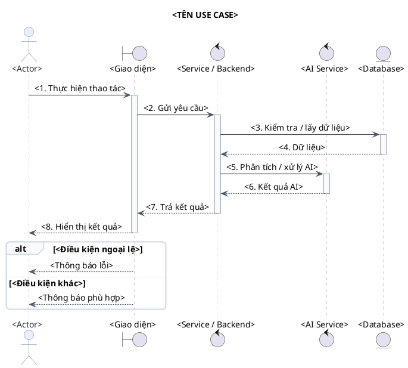
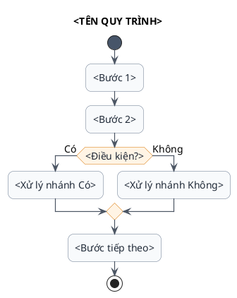
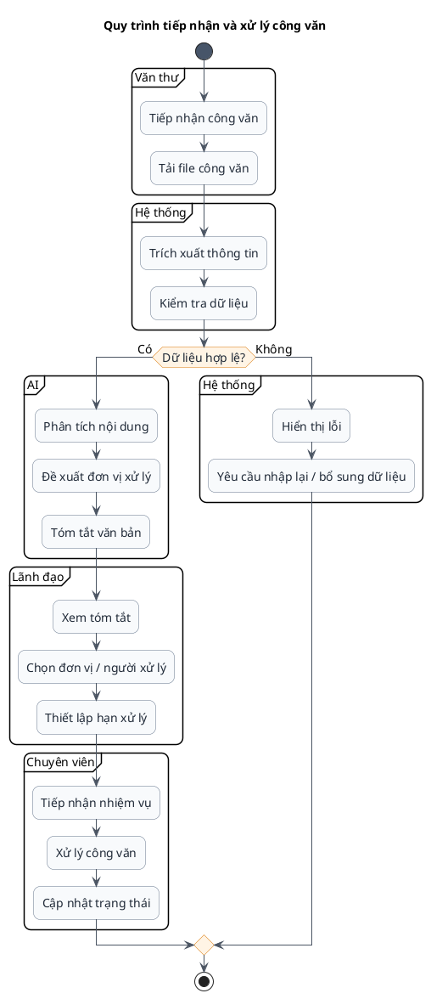
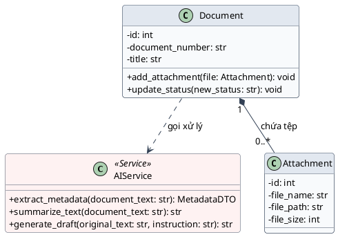

# Skill: Vẽ Biểu đồ UML & ERD (Sequence, Activity, Use Case, Class, ERD) bằng PlantUML

## 1. Mục tiêu

Skill này hướng dẫn tạo các biểu đồ UML và CSDL gồm **Sequence Diagram (Biểu đồ tuần tự)**, **Activity Diagram (Biểu đồ hoạt động)**, **Use Case Diagram (Biểu đồ ca sử dụng)**, **Class Diagram (Biểu đồ lớp)** và **ERD (Biểu đồ thực thể - quan hệ)** bằng **PlantUML** theo phong cách:

- Đẹp, sạch, dễ đọc.
- Bố cục khoa học, hạn chế đường giao nhau.
- Màu sắc nhẹ, chuyên nghiệp, phù hợp tài liệu môn học/đồ án.
- Tên thành phần ngắn gọn, nhất quán.
- Có thể copy trực tiếp vào PlantUML/VS Code/IntelliJ/Markdown có hỗ trợ PlantUML.

---

## 2. Nguyên tắc thiết kế chung

### 2.1. Phong cách hình ảnh

Ưu tiên phong cách **modern / academic / minimal**:

```plantuml
skinparam backgroundColor #FFFFFF
skinparam shadowing false
skinparam RoundCorner 12
skinparam defaultFontName Arial
skinparam defaultFontSize 14
skinparam ArrowColor #4B5563
skinparam ArrowThickness 1.2
skinparam NoteBackgroundColor #FFFBEA
skinparam NoteBorderColor #E5C76B
```

### 2.2. Quy tắc màu

Không dùng quá nhiều màu. Chỉ nên có 3–5 màu chính:

| Thành phần | Màu gợi ý |
|---|---|
| Actor | `#E8F0FE` |
| Giao diện | `#E8F7F0` |
| Backend / Service | `#F3E8FF` |
| Database | `#FFF4E5` |
| AI Service | `#FDECEC` |
| Ghi chú | `#FFFBEA` |

Có thể thay đổi màu nhưng phải giữ độ tương phản tốt.

### 2.3. Quy tắc bố cục

1. Đọc từ **trên xuống dưới** và **trái sang phải**.
2. Actor đặt ngoài cùng bên trái/phải.
3. Thành phần chính đặt ở giữa.
4. Database thường nằm cuối luồng hoặc phía bên phải.
5. AI Service nên nằm gần Backend nếu AI được gọi nội bộ.
6. Tránh hơn 6–8 participant trong một sequence diagram. Nếu quá nhiều, tách thành biểu đồ nhỏ hơn.
7. Với activity diagram, dùng `partition` để chia theo vai trò hoặc module khi luồng phức tạp.

---

# 3. Skill: Sequence Diagram

## 3.1. Khi nào sử dụng

Dùng Sequence Diagram để mô tả:

- Ai tương tác với hệ thống.
- Các đối tượng gọi nhau theo thứ tự nào.
- Request/response giữa Frontend, Backend, Database, AI.
- Luồng thành công và ngoại lệ.

Không nên dùng Sequence Diagram để mô tả toàn bộ nghiệp vụ quá dài. Mỗi biểu đồ nên tập trung vào **một use case chính**.

---

## 3.2. Cấu trúc participant nên ưu tiên

Thông thường dùng:

```text
Actor → Boundary/UI → Control/Service → AI Service → Database
```

Ví dụ:

```text
Nhân viên văn thư
      ↓
Giao diện quản lý công văn
      ↓
Document Service
      ↓
AI Service
      ↓
Database
```

---

## 3.3. Template Sequence Diagram đẹp



---

## 3.4. Quy tắc viết message

Ưu tiên message ngắn:

```text
Gửi yêu cầu
Kiểm tra dữ liệu
Lưu công văn
Phân tích nội dung
Đề xuất đơn vị xử lý
Trả kết quả
Hiển thị thông báo
```

Không nên viết:

```text
Hệ thống thực hiện việc kiểm tra toàn bộ thông tin của công văn được người dùng nhập vào trước khi tiến hành lưu dữ liệu...
```

Thay bằng:

```text
Kiểm tra dữ liệu công văn
```

---

## 3.5. Dùng nhóm `alt / opt / loop`

### Điều kiện rẽ nhánh

```plantuml
alt Dữ liệu hợp lệ
    Service --> UI : Trả kết quả
else Dữ liệu không hợp lệ
    Service --> UI : Thông báo lỗi
end
```

### Bước tùy chọn

```plantuml
opt Người dùng yêu cầu AI tóm tắt
    Service -> AI : Tóm tắt văn bản
    AI --> Service : Bản tóm tắt
end
```

### Lặp

```plantuml
loop Với từng tài liệu đính kèm
    Service -> AI : Phân tích tài liệu
    AI --> Service : Kết quả
end
```

---

## 3.6. Dùng `note` đúng cách

```plantuml
note right of AI
AI chỉ đưa ra kết quả
đề xuất; người dùng có
quyền kiểm tra và điều chỉnh.
end note
```

Chỉ dùng note khi cần giải thích quy tắc nghiệp vụ hoặc đặc điểm AI.

---

# 4. Skill: Activity Diagram

## 4.1. Khi nào sử dụng

Dùng Activity Diagram để mô tả:

- Quy trình nghiệp vụ.
- Các bước xử lý từ đầu đến cuối.
- Rẽ nhánh điều kiện.
- Các bước song song.
- Điểm bắt đầu/kết thúc.
- Phân chia trách nhiệm giữa các vai trò.

Activity Diagram nên tập trung vào **workflow**, không mô tả chi tiết request/response giữa từng API.

---

## 4.2. Template Activity Diagram đẹp



---

## 4.3. Activity Diagram có phân vai trò

Khi có nhiều actor, ưu tiên `partition`:



# 5. Skill: Class Diagram (Biểu đồ Lớp)

## 5.1. Khi nào sử dụng
Dùng Class Diagram để mô tả:
- Cấu trúc tĩnh của hệ thống phần mềm hướng đối tượng.
- Danh mục các lớp thực thể (Entities), lớp dịch vụ (Services), lớp điều khiển (Controllers/Routers) và đối tượng truyền tải (DTO/Schemas).
- Thuộc tính (Attributes) kèm phạm vi truy cập (`+`, `-`, `#`), kiểu dữ liệu và các phương thức (Methods) cốt lõi.
- Các mối quan hệ tĩnh giữa các lớp: Sở hữu chặt chẽ (Composition), Thu nạp (Aggregation), Liên kết (Association), Kế thừa (Inheritance) và Phụ thuộc (Dependency).

Không nên dùng Class Diagram để nhồi nhét tất cả các hàm getter/setter hoặc mọi chi tiết nhỏ của database. Biểu đồ phải tập trung vào **ngữ nghĩa nghiệp vụ và cấu trúc phần mềm**.

---

## 5.2. Cấu trúc phân loại lớp nên ưu tiên

Trong kiến trúc hướng đối tượng cho hệ thống quản lý công văn, ưu tiên phân tầng rõ rệt:

```text
Controller / Router (Giao tiếp API)
        ↓  <<calls>>
Service / Control (Xử lý nghiệp vụ & Điều phối AI)
        ↓  <<manages>>
Entity / Model (Dữ liệu thực thể lưu trữ)
```

- `<<Entity>>`: Đại diện cho đối tượng lưu trữ thông tin (`User`, `Document`, `Attachment`, `TaskAssignment`).
- `<<Service>>`: Chứa logic nghiệp vụ và gọi mô hình AI (`DocumentService`, `AIService`, `TaskService`).
- `<<Controller>>` hoặc `<<Router>>`: Điểm tiếp nhận request từ giao diện.
- `<<DTO>>`: Cấu trúc dữ liệu trao đổi hoặc kết quả AI trả về (`MetadataDTO`, `SummaryDTO`).

---

## 5.3. Phong cách hình ảnh & Skinparam chuẩn cho Class Diagram
Ưu tiên phong cách tối giản, học thuật, tắt các biểu tượng icon tròn mặc định của PlantUML (`classAttributeIconSize 0`) và bo góc nhẹ:

```plantuml
skinparam backgroundColor #FFFFFF
skinparam shadowing false
skinparam RoundCorner 8
skinparam defaultFontName Arial
skinparam defaultFontSize 13
skinparam classAttributeIconSize 0

skinparam class {
    BackgroundColor #F8FAFC
    BorderColor #475569
    ArrowColor #334155
    HeaderBackgroundColor #E2E8F0
}

skinparam package {
    BackgroundColor #FAFAFA
    BorderColor #94A3B8
    FontColor #0F172A
    FontStyle bold
}
```

---

## 5.4. Quy ước ký hiệu quan hệ chuẩn UML trong PlantUML

| Quan hệ | Ý nghĩa & Bản chất | Cú pháp PlantUML | Ví dụ trong Quản lý công văn |
|---|---|:---:|---|
| **Inheritance** | Kế thừa / Khái quát hóa | `<|--` | `BaseUser <|-- Clerk` |
| **Realization** | Hiện thực hóa Interface | `<|..` | `IAIService <|.. LocalAIService` |
| **Composition** | Sở hữu chặt (Nếu cha bị xoá, con bị xoá theo) | `*--` | `Document "1" *-- "0..*" Attachment` *(Xoá công văn thì xoá tệp đính kèm)* |
| **Aggregation** | Thu nạp (Tồn tại độc lập) | `o--` | `Department "1" o-- "0..*" User` *(Phòng ban giải thể, người dùng vẫn tồn tại)* |
| **Association** | Liên kết thông thường có chỉ số bội | `-->` hoặc `--` | `User "1" --> "0..*" TaskAssignment : "giao/nhận"` |
| **Dependency** | Phụ thuộc sử dụng tạm thời | `..>` | `DocumentService ..> AIService : "gọi bóc tách/tóm tắt"` |

---

## 5.5. Quy tắc viết Thuộc tính và Phương thức

- **Phạm vi truy cập (Visibility)**:
  - `-` : `Private` (dùng cho hầu hết thuộc tính dữ liệu).
  - `+` : `Public` (dùng cho các phương thức nghiệp vụ).
  - `#` : `Protected` (dùng cho lớp cha kế thừa).
- **Cú pháp**:
  - Thuộc tính: `<visibility> <tên_thuộc_tính>: <kiểu_dữ_liệu>` (Ví dụ: `- document_number: str`, `- deadline: datetime`).
  - Phương thức: `<visibility> <tên_phương_thức>(<tham_số>: <kiểu>): <kiểu_trả_về>` (Ví dụ: `+ update_status(new_status: str): void`).
- **Ngắn gọn & Đúng nghiệp vụ**: Không đưa các hàm phụ trợ linh tinh (như getter, setter, toString) vào sơ đồ để tránh rối mắt.

---

## 5.6. Dùng `package` để phân nhóm module

Khi số lượng lớp trên 6 lớp, bắt buộc dùng `package` để gom nhóm:

```plantuml
package "Quản lý Người dùng & Phân quyền" {
    class User
    class Role
    class Department
}

package "Nghiệp vụ Công văn & Tệp" {
    class Document
    class Attachment
}
```

---

## 5.7. Template Class Diagram chuẩn đẹp



---

# 6. Skill: Use Case Diagram (Biểu đồ Ca sử dụng)

## 6.1. Khi nào sử dụng
Dùng Use Case Diagram để mô tả:
- Ranh giới của hệ thống và phạm vi chức năng (SRS / Phân tích yêu cầu).
- Các tác nhân (Actors) tham gia tương tác với hệ thống (cả tác nhân con người và tác nhân hệ thống thứ cấp).
- Danh mục các ca sử dụng (Use Cases) tương ứng với các yêu cầu chức năng (FR1 đến FR12).
- Mối quan hệ giữa Actor với Use Case (`-->`), và giữa các Use Case với nhau (`<<include>>`, `<<extend>>`).

Không nên dùng Use Case Diagram để mô tả luồng dữ liệu, thuật toán chi tiết hoặc thứ tự thực hiện theo thời gian (đó là vai trò của Activity và Sequence Diagram).

---

## 6.2. Nguyên tắc bố cục chuẩn cho Use Case Diagram
- **Chiều hiển thị**: Luôn dùng chỉ thị `left to right direction` để sơ đồ trải rộng từ trái sang phải, tránh kéo dài dọc gây rối mắt.
- **Vị trí Actor**:
  - **Tác nhân con người (Human Primary Actors)**: Đặt ở **phía ngoài cùng bên trái** (`Văn thư`, `Lãnh đạo`, `Chuyên viên`).
  - **Tác nhân hệ thống thứ cấp (Secondary / System Actors)**: Đặt ở **phía ngoài cùng bên phải** (`Hệ thống AI`).
- **Phân nhóm Package (System Boundary)**: Nhóm các Use Case có cùng nghiệp vụ vào các gói hình chữ nhật (`package`) rõ ràng để người đọc dễ dàng định vị phân hệ chức năng.
- **Đặt tên Use Case**: Bắt đầu bằng động từ + danh từ (VD: `UC1: Đăng nhập & Phân quyền`, `UC8: AI tóm tắt văn bản`).

---

# 7. Skill: ERD Diagram (Biểu đồ Thực thể - Mối quan hệ)

## 7.1. Khi nào sử dụng
Dùng ERD (Entity Relationship Diagram) để mô tả:
- Thiết kế cơ sở dữ liệu quan hệ (RDBMS) ở mức vật lý (Physical Data Model).
- Danh mục các bảng dữ liệu (`entity`), các cột thuộc tính và kiểu dữ liệu SQL chuẩn (`INT`, `VARCHAR`, `TEXT`, `BOOLEAN`, `TIMESTAMP`).
- Khóa chính (`<<PK>>`) và Khóa ngoại (`<<FK>>`).
- Các mối quan hệ toàn vẹn giữa các bảng sử dụng ký hiệu chân quạ (**Crow's Foot Notation**).

---

## 7.2. Cú pháp khai báo Entity trong PlantUML
Sử dụng cấu trúc `entity` với định dạng trực quan:

```plantuml
entity "tên_bảng" as tên_bảng {
    * id : INT <<PK>>
    --
    * khóa_ngoại_id : INT <<FK>>
    * trường_bắt_buộc : VARCHAR(100)
    trường_tùy_chọn : TEXT
}
```
- Dấu `*`: Thể hiện cột bắt buộc (`NOT NULL`).
- Dấu `--`: Đường kẻ ngang ngăn cách giữa Khóa chính (`PK`) và các thuộc tính thông thường.

---

## 7.3. Ký hiệu quan hệ chân quạ (Crow's Foot Notation)

| Ký hiệu PlantUML | Tên quan hệ | Ý nghĩa nghiệp vụ | Ví dụ |
|:---:|---|---|---|
| `||--||` | Một - Một (Bắt buộc) | Một bản ghi bên A gắn đúng 1 bản ghi bên B | `users ||--|| profiles` |
| `||--o{` | Một - Nhiều (0 hoặc nhiều) | Một bản ghi bên A có thể có 0 hoặc nhiều bản ghi bên B | `documents ||--o{ attachments` |
| `||--|{` | Một - Nhiều (Bắt buộc $\ge 1$) | Một bản ghi bên A bắt buộc có ít nhất 1 bản ghi bên B | `orders ||--|{ order_items` |

---

# 8. Cách làm biểu đồ dễ nhìn hơn

## 8.1. Sequence Diagram

Nên:
- Giới hạn 5–7 participant.
- Chia luồng thành `group`, `alt`, `opt`, `loop`.
- `activate/deactivate` cho service chính.
- Message có đánh số nếu biểu đồ phục vụ thuyết trình.
- Đặt Database ở gần cuối luồng.
- AI đứng cạnh Backend, không đặt giữa Actor và UI nếu không cần.

Ví dụ:

```plantuml
group Xử lý chính
    Service -> DB : Lấy dữ liệu
    DB --> Service : Dữ liệu

    Service -> AI : Phân tích nội dung
    AI --> Service : Kết quả
end
```

## 8.2. Activity Diagram

Nên:
- Một luồng chính rõ ràng.
- Mỗi action chỉ chứa một hành động.
- Điều kiện viết dưới dạng câu hỏi.
- Nhánh `Có/Không` rõ ràng.
- Dùng `partition` khi muốn cho thấy trách nhiệm của Actor.
- Không nhồi quá nhiều chữ vào mỗi node.

## 8.3. Class Diagram

Nên:
- **Giới hạn số lượng lớp**: Tối đa 7–10 lớp trong một sơ đồ tổng quan. Nếu hệ thống lớn, tách thành: *Mô hình lớp miền (Domain)*, *Mô hình lớp phân hệ Quản lý công văn*, *Mô hình lớp phân hệ Phân công & AI*.
- **Hạn chế đường giao nhau**: Sắp xếp lớp cha ở trên, lớp con ở dưới; Service ở trên, Entity ở dưới; tránh kéo các đường liên kết cắt chéo nhau.
- **Dùng package**: Nhóm các thực thể có liên quan mật thiết vào chung một khối hình chữ nhật (`package`).
- **Ghi rõ chỉ số bội (Multiplicity)**: Luôn ghi rõ `1`, `0..*`, `1..*` ở hai đầu quan hệ để người đọc nắm được quy tắc nghiệp vụ (ví dụ: 1 công văn chứa 0..* tệp đính kèm).
- **Phân màu lớp AI**: Sử dụng màu nền pastel riêng (như `#FEF2F2`) cho `AIService` để làm nổi bật tính năng công nghệ của đề tài.

## 8.4. Use Case Diagram

Nên:
- **Bố cục trái qua phải**: Dùng `left to right direction`.
- **Phân nhóm chức năng**: Dùng `package` bao bọc các Use Case theo phân hệ.
- **Tách biệt Actor**: Đặt Human Actors bên trái, System/AI Actors bên phải.
- **Đường nối thẳng hàng**: Hạn chế để các đường liên kết của Actor cắt chéo nhau quá nhiều.

## 8.5. ERD Diagram (Mô hình Thực thể - Quan hệ)

Nên:
- **Dùng cú pháp `entity`**: Khai báo rõ ràng cấu trúc bảng CSDL, dùng dấu `*` cho các trường bắt buộc (`NOT NULL`) và `--` để ngăn cách phần Khóa chính (`PK`).
- **Đánh dấu rõ vai trò khóa**: Ghi chú rõ ràng `<<PK>>` cho Khóa chính và `<<FK>>` cho Khóa ngoại.
- **Ký hiệu chân quạ (Crow's Foot)**: Sử dụng các quan hệ `||--o{` (Một - Nhiều), `||--||` (Một - Một) để thể hiện chính xác mối quan hệ vật lý.
- **Bố cục khoa học**: Đặt bảng cha ở phía trên hoặc bên trái, bảng con ở phía dưới hoặc bên phải để các đường nối đi thẳng tắp, hạn chế tối đa việc cắt chéo đường quan hệ.
- **Tên bảng số nhiều**: Luôn đặt tên bảng ở dạng danh từ số nhiều và `snake_case` (ví dụ: `documents`, `attachments`, `users`).

---

# 9. Danh mục Biểu đồ Mẫu Hoàn chỉnh (Standard Examples)

Tất cả mã nguồn PlantUML mẫu chuẩn dành riêng cho hệ thống Quản lý Công văn và Văn bản Nội bộ Tích hợp AI được lưu trữ độc lập tại thư mục [`examples/`](file:///d:/nanana-adomixi/.agents/skills/plantuml/examples/):

| STT | Tên Biểu đồ | Tệp mã nguồn (.puml) | Mục đích nghiệp vụ chính |
|:---:|---|---|---|
| 1 | **Use Case Diagram** | [`examples/usecase_diagram.puml`](file:///d:/nanana-adomixi/.agents/skills/plantuml/examples/usecase_diagram.puml) | Tổng quan 12 ca sử dụng (UC1–UC12), 3 Actor người dùng (Văn thư, Lãnh đạo, Chuyên viên) và 1 Actor AI thứ cấp. |
| 2 | **Sequence Diagram** | [`examples/sequence_diagram.puml`](file:///d:/nanana-adomixi/.agents/skills/plantuml/examples/sequence_diagram.puml) | Luồng tương tác thời gian thực khi AI phân tích nội dung và đề xuất đơn vị xử lý. |
| 3 | **Activity Diagram** | [`examples/activity_diagram.puml`](file:///d:/nanana-adomixi/.agents/skills/plantuml/examples/activity_diagram.puml) | Quy trình tiếp nhận, kiểm tra dữ liệu và phân công xử lý công văn liên phòng ban. |
| 4 | **Class Diagram** | [`examples/class_diagram.puml`](file:///d:/nanana-adomixi/.agents/skills/plantuml/examples/class_diagram.puml) | Mô hình lớp thực thể cốt lõi (Master Final), phân tầng 4 package, loại bỏ liên kết enum thừa. |
| 5 | **ERD Diagram** | [`examples/erd_diagram.puml`](file:///d:/nanana-adomixi/.agents/skills/plantuml/examples/erd_diagram.puml) | Thiết kế cơ sở dữ liệu vật lý 8 bảng với ký hiệu chân quạ Crow's Foot. |

---

# 10. Checklist trước khi xuất biểu đồ

## Use Case Diagram
- [ ] Có `left to right direction`.
- [ ] Human Actors nằm bên trái, Secondary/System Actors (AI) nằm bên phải.
- [ ] Các Use Case được gom vào các `package` ranh giới hệ thống rõ ràng.
- [ ] Tên Use Case đánh mã rõ ràng (`UC1`, `UC2`...) khớp với đặc tả yêu cầu (FR).
- [ ] Không vẽ chéo dây bừa bãi giữa các Actor và Use Case.

## Class Diagram
- [ ] Đã tắt icon tròn mặc định (`classAttributeIconSize 0`).
- [ ] Thuộc tính và phương thức có đầy đủ phạm vi truy cập (+, -, #).
- [ ] Phân biệt đúng giữa Composition (*--), Aggregation (o--), Association (-->).
- [ ] Không nhồi nhét quá nhiều chi tiết làm rối biểu đồ.

## ERD Diagram (Mô hình CSDL)
- [ ] Sử dụng đúng cú pháp `entity` và ký hiệu chân quạ Crow's Foot (`||--o{`, `||--||`).
- [ ] Đã đánh dấu đầy đủ `<<PK>>` cho Khóa chính và `<<FK>>` cho các Khóa ngoại.
- [ ] Đã sử dụng dấu `*` cho tất cả các trường dữ liệu bắt buộc (`NOT NULL`).
- [ ] Đã phân cách rõ ràng giữa Khóa chính và các thuộc tính khác bằng dòng kẻ `--`.
- [ ] Tên bảng tuân thủ định dạng số nhiều `snake_case` (VD: `documents`, `users`, `task_assignments`).
- [ ] Các đường nối quan hệ rõ ràng, không bị đè lên chữ của các cột.

## Sequence Diagram

- [ ] Có Actor chính.
- [ ] Có UI/Boundary.
- [ ] Có Service/Control.
- [ ] Database chỉ xuất hiện khi thực sự có thao tác dữ liệu.
- [ ] AI được thể hiện riêng nếu use case có AI.
- [ ] Có thứ tự message rõ ràng.
- [ ] Có `alt/opt/loop` nếu có rẽ nhánh hoặc lặp.
- [ ] Không quá nhiều participant.
- [ ] Không dùng message quá dài.

## Activity Diagram

- [ ] Có `start`.
- [ ] Có `stop`.
- [ ] Các action viết ngắn.
- [ ] Điều kiện được đặt ở diamond.
- [ ] Nhánh Có/Không rõ ràng.
- [ ] Dùng `partition` nếu có nhiều vai trò.
- [ ] Không đưa chi tiết API/request-response vào activity.
- [ ] Luồng chính dễ theo dõi từ trên xuống dưới.

---

# 11. Prompt nội bộ để AI tự sinh PlantUML

Khi được yêu cầu tạo Use Case Diagram:

```text
Hãy tạo Use Case Diagram bằng PlantUML.
Dùng left to right direction, nền trắng, shadowing false, font Arial.
Actors con người (Văn thư, Lãnh đạo, Chuyên viên) đặt bên trái.
Secondary Actor (Hệ thống AI) đặt bên phải.
Bao bọc các Use Case trong System boundary package và các package nghiệp vụ.
Đánh mã UC1 - UC12 khớp với 12 FR của hệ thống.
Chỉ trả về một block @startuml ... @enduml.
```

Khi được yêu cầu tạo Sequence Diagram:

```text
Hãy tạo Sequence Diagram bằng PlantUML.
Ưu tiên bố cục từ trái sang phải, nền trắng, shadowing false,
font Arial, màu pastel nhẹ, RoundCorner 12.
Tối đa 5–7 participant.
Actor đặt bên ngoài, UI/Boundary ở giữa Actor và Backend,
Database gần cuối, AI Service đặt cạnh Backend.
Dùng activate/deactivate, alt/opt/loop khi cần.
Tên message ngắn gọn, mang tính nghiệp vụ.
Không tạo participant thừa.
Chỉ trả về một block @startuml ... @enduml.
```

Khi được yêu cầu tạo Activity Diagram:

```text
Hãy tạo Activity Diagram bằng PlantUML.
Ưu tiên flow từ trên xuống dưới, nền trắng, shadowing false,
font Arial, RoundCorner 16, màu pastel nhẹ.
Mỗi action chỉ mô tả một hành động.
Điều kiện phải là câu hỏi rõ ràng.
Dùng partition để phân biệt Actor/Module khi cần.
Không đưa chi tiết API hoặc database nếu chúng không quan trọng với workflow.
Luồng chính phải nổi bật, nhánh ngoại lệ rõ ràng.
Chỉ trả về một block @startuml ... @enduml.
```

Khi được yêu cầu tạo Class Diagram:

```text
Hãy tạo Class Diagram bằng PlantUML.
Ưu tiên bố cục gọn gàng, nền trắng, shadowing false,
font Arial, RoundCorner 8, màu pastel nhẹ, classAttributeIconSize 0.
Sắp xếp các lớp theo package module rõ ràng.
Hiển thị thuộc tính kèm phạm vi truy cập (+, -) và kiểu dữ liệu.
Hiển thị các phương thức nghiệp vụ cốt lõi kèm kiểu trả về.
Dùng đúng ký hiệu quan hệ UML: Composition (*--), Aggregation (o--), Association (-->), Dependency (..>).
Luôn ghi rõ chỉ số bội (1, 0..*, 1..*) ở hai đầu quan hệ.
Tô màu nền riêng (#FEF2F2) cho các lớp dịch vụ AI.
Chỉ trả về một block @startuml ... @enduml.
```

Khi được yêu cầu tạo ERD Diagram (Mô hình CSDL):

```text
Hãy tạo ERD Diagram bằng PlantUML với ký hiệu chân quạ (Crow's Foot Notation).
Ưu tiên bố cục gọn gàng, nền trắng, shadowing false, font Arial, RoundCorner 8.
Sử dụng cú pháp entity "table_name" as table_name { ... }.
Dùng dấu * cho các trường NOT NULL, phân tách phần PK bằng --.
Ghi rõ kiểu dữ liệu SQL (INT, VARCHAR, TEXT, BOOLEAN, TIMESTAMP).
Đánh dấu rõ ràng <<PK>> và <<FK>>.
Dùng các ký hiệu quan hệ chân quạ: ||--o{ (1 - nhiều), ||--|| (1 - 1).
Tên bảng dạng danh từ số nhiều snake_case (VD: documents, users).
Chỉ trả về một block @startuml ... @enduml.
```

---

# 12. Quy ước đặt tên đề xuất

| Loại | Quy ước |
|---|---|
| Actor | Tên vai trò: `Văn thư`, `Lãnh đạo`, `Chuyên viên` |
| UI | `Giao diện ...` |
| Backend | `Document Service`, `User Service` |
| AI | `AI Service` |
| Database | `Database` |
| Action | Động từ + đối tượng: `Tải công văn`, `Lưu dữ liệu`, `Phân tích nội dung` |
| Condition | Câu hỏi: `Dữ liệu hợp lệ?`, `Đã hoàn thành?` |
| Class Name | Danh từ, PascalCase: `Document`, `Attachment`, `TaskAssignment`, `AIService` |
| Attribute (OOP) | Danh từ, snake_case hoặc camelCase: `document_number`, `deadline`, `status` |
| Method | Động từ + danh từ: `add_attachment()`, `update_status()`, `is_overdue()` |
| Package | Tên cụm danh từ nghiệp vụ: `Quản lý Người dùng`, `Nghiệp vụ Công văn` |
| Table / Entity | Danh từ số nhiều, snake_case: `documents`, `users`, `task_assignments` |
| Primary Key | Tên định danh cố định: `id` |
| Foreign Key | Tên bảng số ít + `_id`: `document_id`, `assigner_id`, `user_id` |
| Column (SQL) | Danh từ, snake_case: `document_number`, `is_approved`, `created_at` |

---

# 13. Kết quả mong muốn

Mỗi biểu đồ được tạo theo skill này phải đạt 4 tiêu chí:

**Đúng nghiệp vụ → Dễ đọc → Nhìn đẹp → Dễ chỉnh sửa.**

Không ưu tiên việc nhồi tất cả chi tiết vào một hình. Khi biểu đồ quá lớn, hãy tách thành các use case/quy trình nhỏ hơn.
