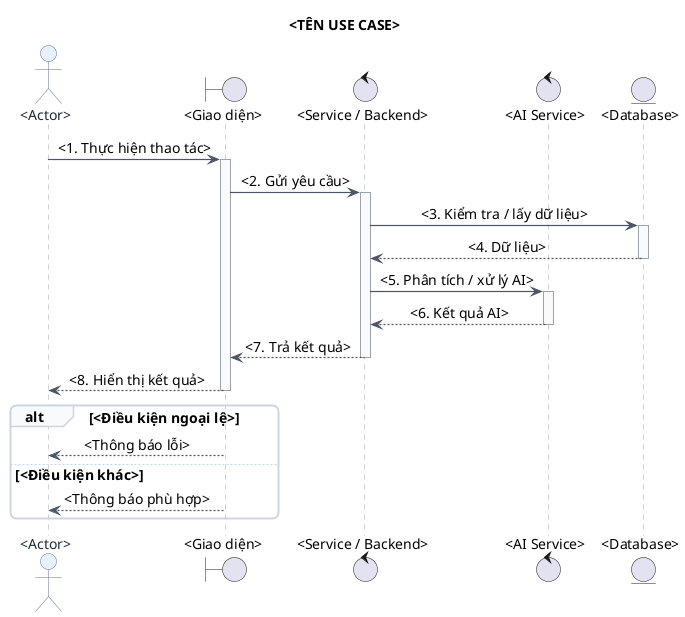
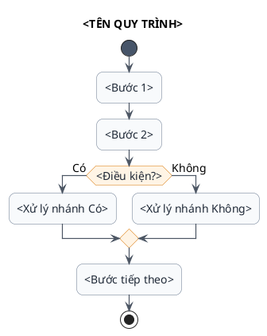
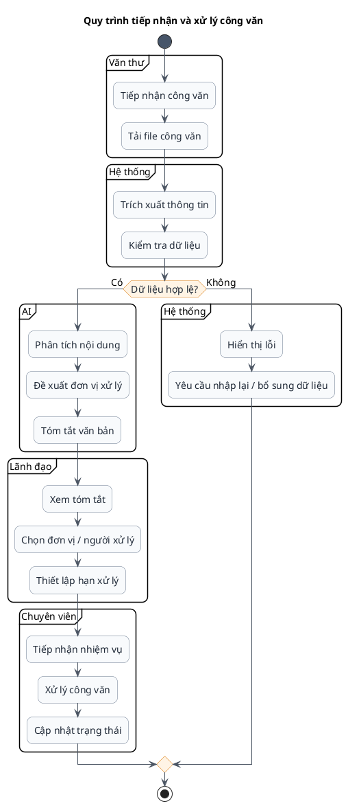
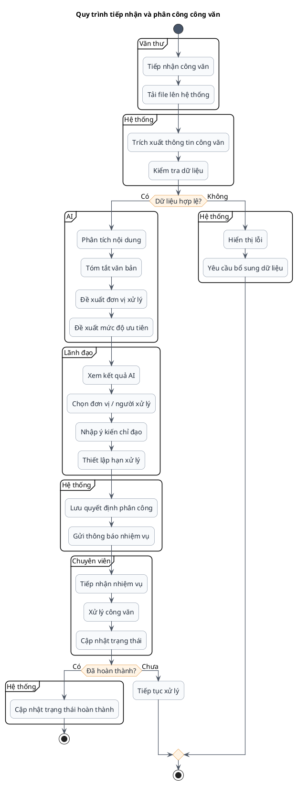

# Skill: Vẽ Biểu đồ Tuần tự & Biểu đồ Hoạt động bằng PlantUML

## 1. Mục tiêu

Skill này hướng dẫn tạo **Sequence Diagram (Biểu đồ tuần tự)** và **Activity Diagram (Biểu đồ hoạt động)** bằng **PlantUML** theo phong cách:

- Đẹp, sạch, dễ đọc.
- Bố cục từ trên xuống, hạn chế đường giao nhau.
- Màu sắc nhẹ, chuyên nghiệp, phù hợp tài liệu môn học/đồ án.
- Tên thành phần ngắn gọn, nhất quán.
- Có thể copy trực tiếp vào PlantUML/VS Code/IntelliJ/Markdown có hỗ trợ PlantUML.

---

## 2. Nguyên tắc thiết kế chung

### 2.1. Phong cách hình ảnh

Ưu tiên phong cách **modern / academic / minimal**:

```plantuml
skinparam backgroundColor #FFFFFF
skinparam shadowing false
skinparam RoundCorner 12
skinparam defaultFontName Arial
skinparam defaultFontSize 14
skinparam ArrowColor #4B5563
skinparam ArrowThickness 1.2
skinparam NoteBackgroundColor #FFFBEA
skinparam NoteBorderColor #E5C76B
```

### 2.2. Quy tắc màu

Không dùng quá nhiều màu. Chỉ nên có 3–5 màu chính:

| Thành phần | Màu gợi ý |
|---|---|
| Actor | `#E8F0FE` |
| Giao diện | `#E8F7F0` |
| Backend / Service | `#F3E8FF` |
| Database | `#FFF4E5` |
| AI Service | `#FDECEC` |
| Ghi chú | `#FFFBEA` |

Có thể thay đổi màu nhưng phải giữ độ tương phản tốt.

### 2.3. Quy tắc bố cục

1. Đọc từ **trên xuống dưới** và **trái sang phải**.
2. Actor đặt ngoài cùng bên trái/phải.
3. Thành phần chính đặt ở giữa.
4. Database thường nằm cuối luồng hoặc phía bên phải.
5. AI Service nên nằm gần Backend nếu AI được gọi nội bộ.
6. Tránh hơn 6–8 participant trong một sequence diagram. Nếu quá nhiều, tách thành biểu đồ nhỏ hơn.
7. Với activity diagram, dùng `partition` để chia theo vai trò hoặc module khi luồng phức tạp.

---

# 3. Skill: Sequence Diagram

## 3.1. Khi nào sử dụng

Dùng Sequence Diagram để mô tả:

- Ai tương tác với hệ thống.
- Các đối tượng gọi nhau theo thứ tự nào.
- Request/response giữa Frontend, Backend, Database, AI.
- Luồng thành công và ngoại lệ.

Không nên dùng Sequence Diagram để mô tả toàn bộ nghiệp vụ quá dài. Mỗi biểu đồ nên tập trung vào **một use case chính**.

---

## 3.2. Cấu trúc participant nên ưu tiên

Thông thường dùng:

```text
Actor → Boundary/UI → Control/Service → AI Service → Database
```

Ví dụ:

```text
Nhân viên văn thư
      ↓
Giao diện quản lý công văn
      ↓
Document Service
      ↓
AI Service
      ↓
Database
```

---

## 3.3. Template Sequence Diagram đẹp



---

## 3.4. Quy tắc viết message

Ưu tiên message ngắn:

```text
Gửi yêu cầu
Kiểm tra dữ liệu
Lưu công văn
Phân tích nội dung
Đề xuất đơn vị xử lý
Trả kết quả
Hiển thị thông báo
```

Không nên viết:

```text
Hệ thống thực hiện việc kiểm tra toàn bộ thông tin của công văn được người dùng nhập vào trước khi tiến hành lưu dữ liệu...
```

Thay bằng:

```text
Kiểm tra dữ liệu công văn
```

---

## 3.5. Dùng nhóm `alt / opt / loop`

### Điều kiện rẽ nhánh

```plantuml
alt Dữ liệu hợp lệ
    Service --> UI : Trả kết quả
else Dữ liệu không hợp lệ
    Service --> UI : Thông báo lỗi
end
```

### Bước tùy chọn

```plantuml
opt Người dùng yêu cầu AI tóm tắt
    Service -> AI : Tóm tắt văn bản
    AI --> Service : Bản tóm tắt
end
```

### Lặp

```plantuml
loop Với từng tài liệu đính kèm
    Service -> AI : Phân tích tài liệu
    AI --> Service : Kết quả
end
```

---

## 3.6. Dùng `note` đúng cách

```plantuml
note right of AI
AI chỉ đưa ra kết quả
đề xuất; người dùng có
quyền kiểm tra và điều chỉnh.
end note
```

Chỉ dùng note khi cần giải thích quy tắc nghiệp vụ hoặc đặc điểm AI.

---

# 4. Skill: Activity Diagram

## 4.1. Khi nào sử dụng

Dùng Activity Diagram để mô tả:

- Quy trình nghiệp vụ.
- Các bước xử lý từ đầu đến cuối.
- Rẽ nhánh điều kiện.
- Các bước song song.
- Điểm bắt đầu/kết thúc.
- Phân chia trách nhiệm giữa các vai trò.

Activity Diagram nên tập trung vào **workflow**, không mô tả chi tiết request/response giữa từng API.

---

## 4.2. Template Activity Diagram đẹp



---

## 4.3. Activity Diagram có phân vai trò

Khi có nhiều actor, ưu tiên `partition`:



---

# 5. Cách làm biểu đồ dễ nhìn hơn

## 5.1. Sequence Diagram

Nên:

- Giới hạn 5–7 participant.
- Chia luồng thành `group`, `alt`, `opt`, `loop`.
- `activate/deactivate` cho service chính.
- Message có đánh số nếu biểu đồ phục vụ thuyết trình.
- Đặt Database ở gần cuối luồng.
- AI đứng cạnh Backend, không đặt giữa Actor và UI nếu không cần.

Ví dụ:

```plantuml
group Xử lý chính
    Service -> DB : Lấy dữ liệu
    DB --> Service : Dữ liệu

    Service -> AI : Phân tích nội dung
    AI --> Service : Kết quả
end
```

## 5.2. Activity Diagram

Nên:

- Một luồng chính rõ ràng.
- Mỗi action chỉ chứa một hành động.
- Điều kiện viết dưới dạng câu hỏi.
- Nhánh `Có/Không` rõ ràng.
- Dùng `partition` khi muốn cho thấy trách nhiệm của Actor.
- Không nhồi quá nhiều chữ vào mỗi node.

---

# 6. Template dành riêng cho hệ thống quản lý công văn tích hợp AI

## 6.1. Sequence: AI đề xuất đơn vị xử lý

```plantuml
@startuml
skinparam backgroundColor #FFFFFF
skinparam shadowing false
skinparam RoundCorner 12
skinparam defaultFontName Arial
skinparam defaultFontSize 14
skinparam sequence {
    ArrowColor #4B5563
    ArrowThickness 1.2
    LifeLineBorderColor #9CA3AF
    LifeLineBackgroundColor #F9FAFB
    ParticipantBorderColor #64748B
    ParticipantBackgroundColor #F8FAFC
    ParticipantFontColor #1F2937
    ActorBackgroundColor #E8F0FE
    ActorBorderColor #64748B
    GroupBackgroundColor #F8FAFC
    GroupBorderColor #CBD5E1
}

title AI đề xuất đơn vị xử lý công văn

actor "Văn thư" as Clerk
boundary "Giao diện công văn" as UI
control "Document Service" as Service
control "AI Service" as AI
entity "Database" as DB

Clerk -> UI : Tải công văn
activate UI

UI -> Service : Gửi file
activate Service

Service -> DB : Lưu file & thông tin ban đầu
DB --> Service : Đã lưu

Service -> AI : Phân tích nội dung
activate AI
AI --> Service : Đề xuất đơn vị xử lý
          + mức độ ưu tiên
          + tóm tắt
 deactivate AI

Service --> UI : Trả kết quả đề xuất
deactivate Service

UI --> Clerk : Hiển thị kết quả AI
deactivate UI

note right of AI
AI chỉ đưa ra đề xuất.
Văn thư / lãnh đạo có thể
kiểm tra và điều chỉnh.
end note

@enduml
```

---

## 6.2. Activity: Tiếp nhận và phân công công văn



---

# 7. Checklist trước khi xuất biểu đồ

## Sequence Diagram

- [ ] Có Actor chính.
- [ ] Có UI/Boundary.
- [ ] Có Service/Control.
- [ ] Database chỉ xuất hiện khi thực sự có thao tác dữ liệu.
- [ ] AI được thể hiện riêng nếu use case có AI.
- [ ] Có thứ tự message rõ ràng.
- [ ] Có `alt/opt/loop` nếu có rẽ nhánh hoặc lặp.
- [ ] Không quá nhiều participant.
- [ ] Không dùng message quá dài.

## Activity Diagram

- [ ] Có `start`.
- [ ] Có `stop`.
- [ ] Các action viết ngắn.
- [ ] Điều kiện được đặt ở diamond.
- [ ] Nhánh Có/Không rõ ràng.
- [ ] Dùng `partition` nếu có nhiều vai trò.
- [ ] Không đưa chi tiết API/request-response vào activity.
- [ ] Luồng chính dễ theo dõi từ trên xuống dưới.

---

# 8. Prompt nội bộ để AI tự sinh PlantUML

Khi được yêu cầu tạo Sequence Diagram:

```text
Hãy tạo Sequence Diagram bằng PlantUML.
Ưu tiên bố cục từ trái sang phải, nền trắng, shadowing false,
font Arial, màu pastel nhẹ, RoundCorner 12.
Tối đa 5–7 participant.
Actor đặt bên ngoài, UI/Boundary ở giữa Actor và Backend,
Database gần cuối, AI Service đặt cạnh Backend.
Dùng activate/deactivate, alt/opt/loop khi cần.
Tên message ngắn gọn, mang tính nghiệp vụ.
Không tạo participant thừa.
Chỉ trả về một block @startuml ... @enduml.
```

Khi được yêu cầu tạo Activity Diagram:

```text
Hãy tạo Activity Diagram bằng PlantUML.
Ưu tiên flow từ trên xuống dưới, nền trắng, shadowing false,
font Arial, RoundCorner 16, màu pastel nhẹ.
Mỗi action chỉ mô tả một hành động.
Điều kiện phải là câu hỏi rõ ràng.
Dùng partition để phân biệt Actor/Module khi cần.
Không đưa chi tiết API hoặc database nếu chúng không quan trọng với workflow.
Luồng chính phải nổi bật, nhánh ngoại lệ rõ ràng.
Chỉ trả về một block @startuml ... @enduml.
```

---

# 9. Quy ước đặt tên đề xuất

| Loại | Quy ước |
|---|---|
| Actor | Tên vai trò: `Văn thư`, `Lãnh đạo`, `Chuyên viên` |
| UI | `Giao diện ...` |
| Backend | `Document Service`, `User Service` |
| AI | `AI Service` |
| Database | `Database` |
| Action | Động từ + đối tượng: `Tải công văn`, `Lưu dữ liệu`, `Phân tích nội dung` |
| Condition | Câu hỏi: `Dữ liệu hợp lệ?`, `Đã hoàn thành?` |

---

# 10. Kết quả mong muốn

Mỗi biểu đồ được tạo theo skill này phải đạt 4 tiêu chí:

**Đúng nghiệp vụ → Dễ đọc → Nhìn đẹp → Dễ chỉnh sửa.**

Không ưu tiên việc nhồi tất cả chi tiết vào một hình. Khi biểu đồ quá lớn, hãy tách thành các use case/quy trình nhỏ hơn.
