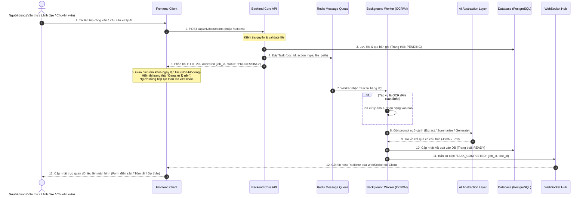
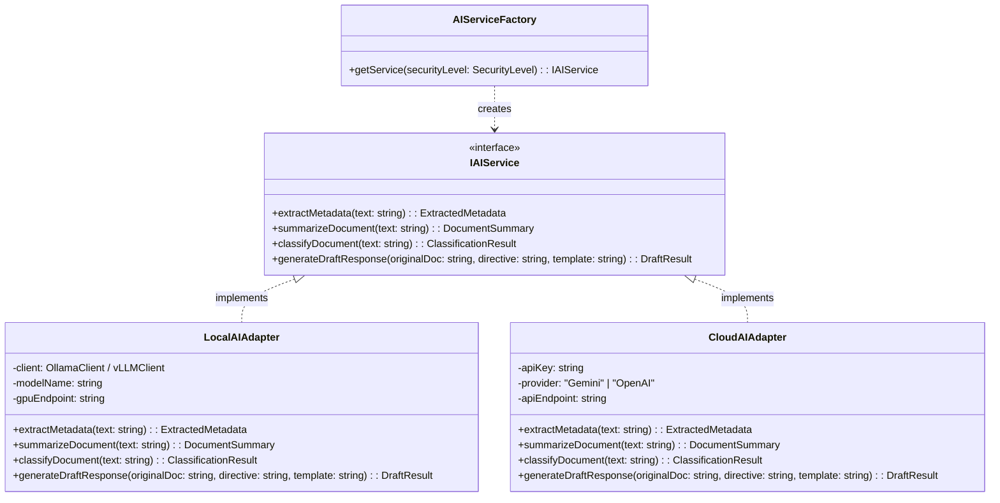
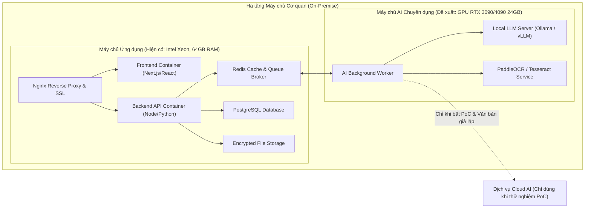

# TÀI LIỆU THIẾT KẾ KIẾN TRÚC HỆ THỐNG (SYSTEM ARCHITECTURE DESIGN)
## DỰ ÁN: HỆ THỐNG QUẢN LÝ CÔNG VĂN VÀ VĂN BẢN NỘI BỘ TÍCH HỢP AI

---

## 1. TỔNG QUAN VÀ NGUYÊN TẮC THIẾT KẾ

### 1.1. Mục tiêu kiến trúc
Tài liệu này xác định kiến trúc tổng thể của Hệ thống quản lý công văn và văn bản nội bộ tích hợp AI, đáp ứng toàn diện các yêu cầu chức năng (FR1 – FR12) và phi chức năng (NFR1 – NFR6) đã được phê duyệt tại `docs/requirements.md`.

Các mục tiêu kiến trúc trọng tâm bao gồm:
1. **Phân tách rõ ràng Frontend và Backend**: Giao tiếp chuẩn hóa thông qua RESTful API và cơ chế thông báo thời gian thực (WebSocket/SSE).
2. **Xử lý AI bất đồng bộ (Non-blocking Asynchronous Execution)**: Tách biệt hoàn toàn các tác vụ tốn tài nguyên tính toán (OCR, trích xuất siêu dữ liệu, tóm tắt LLM, sinh dự thảo) khỏi luồng xử lý web chính bằng kiến trúc hàng đợi Message Queue và Background Worker, đảm bảo UI phản hồi tức thì (< 1s).
3. **Độc lập và linh hoạt nhà cung cấp AI (AI Provider Agnostic)**: Thiết kế lớp trừu tượng hóa AI (AI Abstraction Layer) theo mẫu thiết kế Adapter Pattern, hỗ trợ hoán đổi linh hoạt giữa Cloud AI (Gemini/OpenAI) trong giai đoạn thử nghiệm và Local AI (Ollama/vLLM trên GPU RTX 3090/4090) trong môi trường bảo mật nội bộ.
4. **Bảo mật đa tầng và kiểm soát phân quyền nghiêm ngặt**: Thực thi nguyên tắc "văn bản giao cho ai/phòng nào thì chỉ người đó/phòng đó có quyền truy cập", mã hóa dữ liệu tại chỗ và cô lập hoàn toàn văn bản mật khỏi Internet.

---

## 2. KIẾN TRÚC MỨC CAO (HIGH-LEVEL ARCHITECTURE)

Hệ thống được thiết kế theo kiến trúc phân lớp hướng dịch vụ (Layered Service-Oriented Architecture), gồm 5 khối chính:
1. **Presentation Layer (Frontend)**: Web Application SPA/Responsive tối ưu cho Desktop PC và Tablet.
2. **API & Business Logic Layer (Backend API Gateway & Core Services)**: Quản lý nghiệp vụ, xác thực, phân quyền và điều phối luồng.
3. **Asynchronous Task Processing Layer (Queue & Workers)**: Điều phối và xử lý tác vụ nền (OCR, AI inference).
4. **AI Abstraction Layer (AI Engine)**: Lớp cổng kết nối mô hình ngôn ngữ lớn (Local AI & Cloud AI).
5. **Data & Storage Layer**: Cơ sở dữ liệu quan hệ, Cache/Queue Broker và kho lưu trữ tệp bảo mật.

### Sơ đồ kiến trúc tổng thể (Container Diagram)

```mermaid
flowchart TB
    subgraph ClientLayer ["1. Presentation Layer (Clients)"]
        PC_VT["Văn thư (Desktop PC)\nWeb Browser"]
        PC_CV["Chuyên viên (Desktop PC)\nWeb Browser"]
        TAB_LD["Lãnh đạo (PC & Tablet)\nWeb Browser"]
    end

    subgraph APILayer ["2. API & Application Layer (Backend)"]
        API_GW["API Gateway & Reverse Proxy\n(Nginx)"]
        CORE_API["Backend Application Service\n(REST API + Auth + RBAC/ABAC)"]
        WS_HUB["WebSocket / SSE Hub\n(Realtime Notification)"]
    end

    subgraph QueueLayer ["3. Asynchronous Task Processing"]
        TASK_QUEUE["Message Broker / Task Queue\n(Redis / Celery / BullMQ)"]
        OCR_WORKER["OCR Background Worker\n(Text Extraction Engine)"]
        AI_WORKER["AI Background Worker\n(LLM Task Processor)"]
    end

    subgraph AILayer ["4. AI Abstraction Layer"]
        AI_ADAPTER["AI Service Abstraction\n(Adapter Interface)"]
        LOCAL_AI["Local AI Engine (GPU On-Premise)\n(Ollama / vLLM - RTX 3090/4090)"]
        CLOUD_AI["Cloud AI Provider (PoC / Mock Data)\n(Google Gemini / OpenAI API)"]
    end

    subgraph DataLayer ["5. Data & Storage Layer"]
        RELATIONAL_DB["Relational Database\n(PostgreSQL)\nMetadata, Users, Logs"]
        REDIS_CACHE["Redis In-Memory\nSession, Cache, Queue"]
        SECURE_STORAGE["Encrypted Document Storage\n(Local Encrypted Volume / MinIO)"]
    end

    %% Client to Backend
    PC_VT -->|HTTPS / REST| API_GW
    PC_CV -->|HTTPS / REST| API_GW
    TAB_LD -->|HTTPS / REST| API_GW

    API_GW --> CORE_API
    API_GW --> WS_HUB

    %% Core API interactions
    CORE_API -->|Read/Write Metadata| RELATIONAL_DB
    CORE_API -->|Store Raw Files| SECURE_STORAGE
    CORE_API -->|Push Async Jobs| TASK_QUEUE
    CORE_API -->|Session & RateLimit| REDIS_CACHE

    %% Realtime push to clients
    WS_HUB -.->|Realtime Push Event| PC_VT
    WS_HUB -.->|Realtime Push Event| PC_CV
    WS_HUB -.->|Realtime Push Event| TAB_LD

    %% Worker interactions
    TASK_QUEUE --> OCR_WORKER
    TASK_QUEUE --> AI_WORKER
    OCR_WORKER -->|Read Raw Scan File| SECURE_STORAGE
    OCR_WORKER -->|Push OCR Result Job| TASK_QUEUE

    AI_WORKER -->|Call Inferences| AI_ADAPTER
    AI_ADAPTER -->|Internal / Confidential Doc| LOCAL_AI
    AI_ADAPTER -->|Mock / Public Doc (PoC)| CLOUD_AI

    AI_WORKER -->|Save Extracted/Generated Data| RELATIONAL_DB
    AI_WORKER -->|Notify Task Done| WS_HUB
```

---

## 3. THIẾT KẾ CHI TIẾT CÁC PHÂN HỆ

### 3.1. Phân hệ Giao diện người dùng (Frontend Web Application)
- **Công nghệ đề xuất**: React.js / Next.js hoặc Vue.js kèm Tailwind CSS / Ant Design UI Kit.
- **Đặc tính kỹ thuật**:
  - **Single Page Application (SPA)** hoặc SSR Hybrid tối ưu trải nghiệm người dùng không bị tải lại trang.
  - **Thiết kế Responsive**: Tối ưu hai giao diện chính:
    - *Desktop View (PC)*: Dành cho Văn thư (giao diện tiếp nhận chia 2 màn hình đối soát file gốc và form trích xuất) và Chuyên viên (trình soạn thảo dự thảo rich text song song tệp gốc).
    - *Tablet / Mobile View*: Dành cho Lãnh đạo tối ưu màn hình cảm ứng, hiển thị danh thiếp tóm tắt 3-5 ý cốt lõi, nút bấm phê duyệt/chỉ đạo nhanh một chạm.
  - **Non-blocking UX & State Management**: Trạng thái các tác vụ nặng được cập nhật thông qua thanh tiến trình / badge ngầm, người dùng tự do điều hướng và làm việc với các văn bản khác.
  - **Real-time Client**: Tích hợp WebSocket / SSE Client tự động lắng nghe sự kiện hoàn tất tác vụ từ Backend để cập nhật UI tức thời.

### 3.2. Phân hệ Backend API & Business Logic
- **Kiến trúc mã nguồn**: Modular Monolith hoặc Microservices nhẹ nhàng (Node.js/NestJS hoặc Python/FastAPI), áp dụng mô hình Clean Architecture (Controller -> Service -> Repository).
- **Trách nhiệm chính**:
  - **Authentication & Authorization**: Cấp phát và xác thực JWT token; thực thi bộ lọc phân quyền RBAC kết hợp ABAC (kiểm tra quyền truy cập theo cơ quan, phòng ban, phân công).
  - **Document Lifecycle Management**: Tiếp nhận, tạo số, quản lý luồng trạng thái công văn (*Mới tiếp nhận -> Chờ chỉ đạo -> Đang xử lý -> Chờ duyệt -> Đã ban hành/Hoàn thành*).
  - **File Handler**: Tiếp nhận file đính kèm, kiểm tra MIME type, mã hóa và lưu trữ an toàn.
  - **Job Dispatcher**: Đóng gói payload công việc và đẩy vào Message Queue, sinh `job_id` trả về ngay cho client.
  - **Notification Hub**: Gửi thông báo đẩy nội bộ (nhắc hạn công văn, kết quả xử lý AI) qua WebSocket.

### 3.3. Phân hệ Xử lý Bất đồng bộ (Task Queue & Background Workers)
- **Message Broker**: Sử dụng **Redis** làm Message Queue kết hợp framework quản lý hàng đợi phân tán (**Celery** cho Python hoặc **BullMQ** cho Node.js).
- **Cấu trúc hàng đợi ưu tiên (Priority Queues)**:
  1. `high-priority-queue`: Dành cho công văn Hỏa tốc, Thượng khẩn, hoặc yêu cầu tóm tắt tức thời của Lãnh đạo.
  2. `default-priority-queue`: Dành cho trích xuất siêu dữ liệu và gợi ý phân loại của Văn thư.
  3. `batch-priority-queue`: Dành cho các tác vụ OCR file PDF scan nặng nhiều trang (20-50 trang).
- **Thành phần Worker**:
  - **OCR Worker**: Nhận diện ký tự cho văn bản scan/ảnh chụp, tiền xử lý ảnh (khử nghiêng, lọc nhiễu, tăng độ tương phản), trích xuất chuỗi text thô.
  - **AI Worker**: Tiếp nhận text thô, xây dựng Prompt ngữ cảnh, gọi lớp `AI Abstraction Layer`, đối soát JSON output và ghi kết quả vào Database.

### 3.4. Phân hệ Dữ liệu & Lưu trữ (Data & Storage)
- **PostgreSQL**: CSDL quan hệ chính. Lưu trữ: Người dùng, Vai trò, Đơn vị/Phòng ban, Sổ công văn, Metadata công văn, Lịch sử chỉ đạo/phân công, Bản tóm tắt, Nội dung dự thảo.
- **Redis Cache & Pub/Sub**: Quản lý phiên đăng nhập (Session/Token blacklist), Cache dữ liệu tra cứu thường xuyên, hàng đợi Message Queue và kênh Pub/Sub cho WebSocket.
- **Document Storage**: Lưu trữ file nhị phân (PDF, Word, Ảnh scan) trên phân vùng ổ đĩa mã hóa nội bộ (Encrypted Volume) hoặc S3-compatible Object Storage On-Premise (MinIO).

---

## 4. LUỒNG XỬ LÝ AI BẤT ĐỒNG BỘ (ASYNCHRONOUS AI PROCESSING FLOW)

Để triệt tiêu tình trạng nghẽn, đơ giao diện khi xử lý các tệp scan nặng hoặc khi mô hình AI phản hồi chậm, toàn bộ chu trình xử lý được phân tách thành luồng bất đồng bộ 2 pha: **Pha tiếp nhận nhanh** và **Pha xử lý ngầm**.

### 4.1. Sơ đồ tuần tự xử lý tác vụ nặng (Sequence Diagram)



### 4.2. Cơ chế xử lý sự cố & Đảm bảo độ tin cậy (Fault Tolerance)
- **Retry Mechanism**: Tự động thử lại tối đa 3 lần với cơ chế Exponential Backoff nếu gặp sự cố quá tải GPU hoặc nghẽn mạng API.
- **Dead Letter Queue (DLQ)**: Khi một tác vụ thất bại sau 3 lần thử lại, chuyển vào hàng đợi DLQ để admin kiểm tra và thông báo lỗi rõ ràng cho người dùng (ví dụ: "File ảnh quá mờ không thể nhận diện").
- **Timeout Management**: Áp dụng hard-timeout cho từng loại tác vụ (OCR: 60s, LLM Extract/Summarize: 30s, Draft Gen: 45s).

---

## 5. THIẾT KẾ LỚP TRỪU TƯỢNG HÓA AI (AI ABSTRACTION LAYER)

### 5.1. Mẫu thiết kế Adapter Pattern
Để đảm bảo NFR6 (Độc lập nhà cung cấp AI) và NFR1 (Bảo vệ dữ liệu mật nội bộ), hệ thống thiết kế một Interface chuẩn hóa duy nhất. Logic nghiệp vụ cốt lõi chỉ giao tiếp với Interface này mà không phụ thuộc vào bất kỳ SDK bên ngoài nào.



### 5.2. Chính sách điều phối mô hình & Bảo mật dữ liệu (Routing Policy)
Hệ thống sử dụng bộ lọc chính sách định tuyến tự động (`AIServiceFactory`):
- **Điều kiện 1 - Văn bản nội bộ / Mật (Confidential/Secret)**:
  - Bắt buộc 100% định tuyến qua `LocalAIAdapter`.
  - Thực thi cục bộ trên máy chủ nội bộ có GPU (RTX 3090/4090), ngắt toàn bộ kết nối ngoại vi ra Internet.
- **Điều kiện 2 - Giai đoạn thử nghiệm PoC / Dữ liệu giả lập (Public/Mock)**:
  - Cho phép cấu hình qua file biến môi trường (`AI_PROVIDER=CLOUD_GEMINI` hoặc `AI_PROVIDER=LOCAL`).
  - Hỗ trợ phát triển và kiểm chứng nhanh luồng nghiệp vụ khi cơ quan chưa kịp lắp đặt phần cứng GPU.

---

## 6. THIẾT KẾ KIẾN TRÚC RESTFUL API

Toàn bộ các yêu cầu chức năng được ánh xạ qua các Endpoint RESTful chuẩn hóa:

| Nhóm API | Phương thức | Endpoint | Mô tả chức năng | Tác vụ AI / Ghi chú |
|:---|:---:|:---|:---|:---:|
| **Auth** | `POST` | `/api/v1/auth/login` | Đăng nhập hệ thống & trả về JWT Token | - |
| | `GET` | `/api/v1/auth/me` | Lấy thông tin người dùng và quyền hạn | - |
| **Documents** | `POST` | `/api/v1/documents` | Tải lên file công văn đến, kích hoạt OCR & Trích xuất | Bất đồng bộ (202 Accepted) |
| | `GET` | `/api/v1/documents` | Lọc, tra cứu danh sách công văn theo phân quyền | Phản hồi < 1s |
| | `GET` | `/api/v1/documents/{id}` | Lấy chi tiết công văn, metadata và tóm tắt | Phản hồi < 500ms |
| | `PUT` | `/api/v1/documents/{id}` | Cập nhật thông tin công văn sau đối soát | - |
| | `POST` | `/api/v1/documents/{id}/forward` | Văn thư chuyển công văn trình Lãnh đạo | - |
| **Workflow** | `POST` | `/api/v1/documents/{id}/assign` | Lãnh đạo nhập chỉ đạo, giao việc & hạn chót | Gửi thông báo đến CV |
| | `POST` | `/api/v1/documents/{id}/status` | Chuyên viên cập nhật tiến độ xử lý | - |
| | `POST` | `/api/v1/documents/{id}/approve` | Lãnh đạo phê duyệt văn bản dự thảo | Đẩy sang Văn thư cấp số |
| **AI Tasks** | `POST` | `/api/v1/documents/{id}/ai/summarize` | Kích hoạt tóm tắt văn bản thông minh (3-5 ý) | Bất đồng bộ (202 Accepted) |
| | `POST` | `/api/v1/documents/{id}/ai/classify` | Kích hoạt AI gợi ý phân loại và độ khẩn | Bất đồng bộ (202 Accepted) |
| | `POST` | `/api/v1/documents/{id}/ai/generate-draft`| Kích hoạt AI sinh văn bản dự thảo phản hồi | Bất đồng bộ (202 Accepted) |
| | `GET` | `/api/v1/tasks/{job_id}` | Kiểm tra trạng thái tiến trình nền | Trả về tiến độ % & kết quả |
| **Dashboard** | `GET` | `/api/v1/analytics/dashboard` | Thống kê số lượng, tiến độ đúng hạn/quá hạn | Phục vụ Lãnh đạo (Tablet/PC) |
| **Realtime** | `WS` | `/ws/notifications` | Kết nối WebSocket nhận thông báo & tiến trình AI | Realtime Event Bus |

---

## 7. MÔ HÌNH BẢO MẬT & PHÂN QUYỀN TRUY CẬP

Hệ thống kết hợp 2 mô hình phân quyền:
1. **Role-Based Access Control (RBAC)**: Kiểm soát hành động theo vai trò người dùng:
   - *Văn thư*: Quyền tiếp nhận, tải file, chạy OCR, bóc tách thông tin, vào sổ, phát hành.
   - *Lãnh đạo*: Quyền xem tóm tắt, giao việc, phê duyệt dự thảo, xem báo cáo tổng thể.
   - *Chuyên viên*: Quyền tra cứu, kích hoạt sinh dự thảo, sửa bản thảo, cập nhật trạng thái.
2. **Attribute-Based Access Control (ABAC)**: Kiểm soát dữ liệu ở cấp độ bản ghi (Data-level Security):
   - Quy tắc nghiệp vụ cốt lõi: **"Văn bản giao cho ai/phòng nào thì chỉ người đó/phòng đó có quyền truy cập"**.
   - Bộ lọc CSDL luôn gắn kèm điều kiện:
     `WHERE doc.department_id = user.department_id OR doc.assigned_to = user.id OR user.role = 'LEADER'`
   - Ngăn chặn triệt để hành vi can thiệp ID hoặc xem chéo hồ sơ giữa các phòng ban chuyên môn.

---

## 8. CHIẾN LƯỢC HẠ TẦNG VÀ TRIỂN KHAI (DEPLOYMENT ARCHITECTURE)



- **Môi trường hiện tại**: Máy chủ Intel Xeon, 64GB RAM đáp ứng dư thừa năng lực chạy Nginx, Frontend, Backend API, Redis và PostgreSQL.
- **Môi trường AI bổ sung**: Trang bị máy chủ GPU NVIDIA RTX 3090 hoặc 4090 (24GB VRAM) kết nối qua mạng nội bộ LAN Gigabit tốc độ cao, đảm bảo độ trễ truyền dữ liệu nội bộ < 5ms và tuyệt đối an toàn an ninh thông tin.
Status: APPROVED

