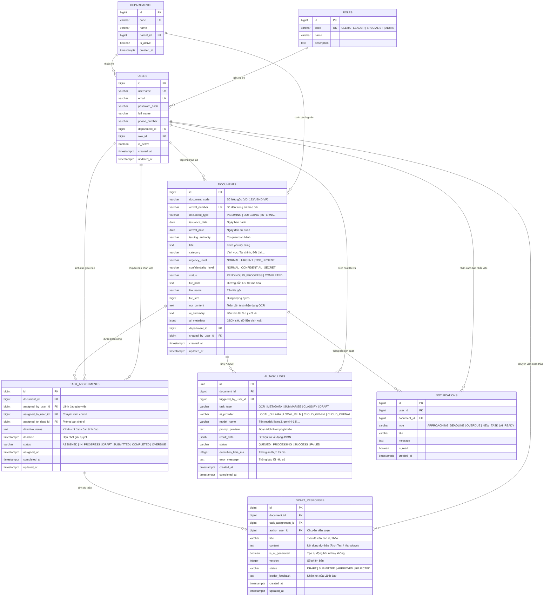

# TÀI LIỆU THIẾT KẾ CƠ SỞ DỮ LIỆU (DATABASE DESIGN SPECIFICATION)
## DỰ ÁN: HỆ THỐNG QUẢN LÝ CÔNG VĂN VÀ VĂN BẢN NỘI BỘ TÍCH HỢP AI

---

## 1. TỔNG QUAN VÀ NGUYÊN TẮC THIẾT KẾ CSDL

### 1.1. Mục tiêu thiết kế
Thiết kế Cơ sở dữ liệu (CSDL) này nhằm hiện thực hóa toàn bộ các yêu cầu lưu trữ và nghiệp vụ từ `docs/requirements.md` và kiến trúc hệ thống tại `docs/architecture.md`.
- **Hệ quản trị CSDL lựa chọn**: **PostgreSQL 15+** (tận dụng tối đa hỗ trợ JSONB cho dữ liệu AI có cấu trúc, Full-Text Search / pg_trgm cho tra cứu văn bản tiếng Việt tốc độ cao, và tính toàn vẹn dữ liệu ACID mạnh mẽ).
- **Chuẩn hóa dữ liệu**: Tuân thủ nghiêm ngặt **Chuẩn hóa dạng 3 (3NF)** để loại bỏ dư thừa dữ liệu và chống bất thường khi cập nhật.
- **Tối ưu hóa hiệu năng**: Đánh chỉ mục (Indexing) đa tầng phục vụ các truy vấn lọc công văn theo phân quyền ABAC, cảnh báo hạn xử lý tự động và báo cáo Dashboard tức thời cho Lãnh đạo.

### 1.2. Quy ước đặt tên (Naming Conventions)
- **Tên bảng**: Danh từ số nhiều, chữ thường, phân tách bằng dấu gạch dưới (`snake_case`), ví dụ: `documents`, `users`, `task_assignments`, `ai_task_logs`.
- **Tên cột**: Chữ thường `snake_case`, ví dụ: `document_code`, `created_at`, `assigned_to_user_id`.
- **Khóa chính**: `id` (sử dụng kiểu số tự tăng `BIGSERIAL` hoặc `UUID` định danh phân tán).
- **Khóa ngoại**: `<tên_bảng_số_ít>_id`, ví dụ: `document_id`, `department_id`, `assigned_by_user_id`.
- **Cột thời gian**: Chuẩn hóa kiểu `TIMESTAMPTZ` (Timestamp with Time Zone), luôn có `created_at` và `updated_at`.
- **Cột cờ nhị phân (Boolean)**: Bắt đầu bằng tiền tố `is_` hoặc `has_`, ví dụ: `is_confidential`, `is_read`, `is_active`.

---

## 2. SƠ ĐỒ QUAN HỆ THỰC THỂ (ENTITY RELATIONSHIP DIAGRAM - ERD)



---

## 3. CHI TIẾT CÁC BẢNG DỮ LIỆU (DATA DICTIONARY)

### 3.1. Bảng `departments` (Đơn vị / Phòng ban)
Lưu trữ cơ cấu tổ chức phục vụ kiểm soát phân quyền dữ liệu ABAC (văn bản giao phòng ban nào thì phòng ban đó xử lý).

| Tên cột | Kiểu dữ liệu | Ràng buộc | Mô tả |
|:---|:---|:---:|:---|
| `id` | `BIGSERIAL` | **PK** | Khóa chính tự tăng |
| `code` | `VARCHAR(50)` | **UNIQUE, NOT NULL** | Mã định danh phòng ban (VD: `VP`, `TCKH`, `QLDT`, `NV`) |
| `name` | `VARCHAR(255)` | **NOT NULL** | Tên đầy đủ phòng ban (VD: *Phòng Tài chính - Kế hoạch*) |
| `parent_id` | `BIGINT` | **FK** | Tham chiếu đệ quy đến `departments.id` (phòng cấp cha) |
| `is_active` | `BOOLEAN` | **DEFAULT TRUE** | Trạng thái hoạt động |
| `created_at` | `TIMESTAMPTZ` | **DEFAULT NOW()** | Thời điểm khởi tạo |

---

### 3.2. Bảng `roles` (Vai trò người dùng)
Định nghĩa 3 vai trò chính quy định trong khảo sát kèm vai trò quản trị hệ thống.

| Tên cột | Kiểu dữ liệu | Ràng buộc | Mô tả |
|:---|:---|:---:|:---|
| `id` | `BIGSERIAL` | **PK** | Khóa chính tự tăng |
| `code` | `VARCHAR(50)` | **UNIQUE, NOT NULL** | Mã vai trò: `CLERK` (Văn thư), `LEADER` (Lãnh đạo), `SPECIALIST` (Chuyên viên), `ADMIN` |
| `name` | `VARCHAR(100)` | **NOT NULL** | Tên hiển thị (Văn thư cơ quan, Lãnh đạo chỉ đạo, Chuyên viên thụ lý...) |
| `description` | `TEXT` | NULL | Diễn giải trách nhiệm và quyền hạn |

---

### 3.3. Bảng `users` (Người dùng hệ thống)
Quản lý danh tính cán bộ, công chức truy cập hệ thống.

| Tên cột | Kiểu dữ liệu | Ràng buộc | Mô tả |
|:---|:---|:---:|:---|
| `id` | `BIGSERIAL` | **PK** | Khóa chính |
| `username` | `VARCHAR(100)` | **UNIQUE, NOT NULL** | Tên đăng nhập |
| `email` | `VARCHAR(255)` | **UNIQUE, NOT NULL** | Địa chỉ thư điện tử công vụ |
| `password_hash`| `VARCHAR(255)` | **NOT NULL** | Chuỗi mật khẩu băm (BCrypt / Argon2) |
| `full_name` | `VARCHAR(255)` | **NOT NULL** | Họ và tên cán bộ |
| `phone_number` | `VARCHAR(20)` | NULL | Số điện thoại liên hệ |
| `department_id`| `BIGINT` | **FK, NOT NULL** | Khóa ngoại trỏ đến `departments.id` |
| `role_id` | `BIGINT` | **FK, NOT NULL** | Khóa ngoại trỏ đến `roles.id` |
| `is_active` | `BOOLEAN` | **DEFAULT TRUE** | Trạng thái tài khoản |
| `created_at` | `TIMESTAMPTZ` | **DEFAULT NOW()** | Thời điểm tạo tài khoản |
| `updated_at` | `TIMESTAMPTZ` | **DEFAULT NOW()** | Thời điểm cập nhật cuối |

---

### 3.4. Bảng `documents` (Quản lý Công văn & Văn bản)
Thực thể trung tâm lưu trữ toàn bộ thông tin hành chính, tệp đính kèm và kết quả bóc tách/tóm tắt từ AI.

| Tên cột | Kiểu dữ liệu | Ràng buộc | Mô tả |
|:---|:---|:---:|:---|
| `id` | `BIGSERIAL` | **PK** | Khóa chính |
| `document_code`| `VARCHAR(100)` | **NOT NULL** | Số ký hiệu gốc (VD: `45/TB-UBND`, `102/BC-STNMT`) |
| `arrival_number`| `VARCHAR(50)` | NULL | Số đến theo sổ theo dõi công văn (VD: `Đ-2026/0125`) |
| `document_type`| `VARCHAR(30)` | **NOT NULL** | Loại văn bản: `INCOMING` (Đến), `OUTGOING` (Đi), `INTERNAL` (Nội bộ) |
| `issuance_date`| `DATE` | **NOT NULL** | Ngày ban hành văn bản |
| `arrival_date` | `DATE` | **DEFAULT CURRENT_DATE**| Ngày cơ quan tiếp nhận văn bản |
| `issuing_authority`| `VARCHAR(255)`| **NOT NULL** | Cơ quan gửi/ban hành (VD: *UBND Thành phố, Sở Tài chính*) |
| `title` | `TEXT` | **NOT NULL** | Trích yếu nội dung công văn |
| `category` | `VARCHAR(100)` | NULL | Nhóm phân loại (AI gợi ý hoặc người dùng chọn) |
| `urgency_level`| `VARCHAR(30)` | **DEFAULT 'NORMAL'** | Độ khẩn: `NORMAL`, `URGENT` (Khẩn), `VERY_URGENT` (Thượng khẩn), `TOP_URGENT` (Hỏa tốc) |
| `confidentiality_level`| `VARCHAR(30)`| **DEFAULT 'NORMAL'** | Độ mật: `NORMAL`, `CONFIDENTIAL` (Mật), `SECRET` (Tuyệt mật) $\rightarrow$ Quyết định dùng Local AI |
| `status` | `VARCHAR(50)` | **NOT NULL, DEFAULT 'PENDING_REVIEW'** | Trạng thái vòng đời: `RECEIVED`, `PENDING_REVIEW`, `ASSIGNED`, `IN_PROGRESS`, `SUBMITTED`, `COMPLETED` |
| `file_path` | `TEXT` | **NOT NULL** | Đường dẫn lưu file trên kho lưu trữ mã hóa |
| `file_name` | `VARCHAR(255)` | **NOT NULL** | Tên tệp gốc khi tải lên |
| `file_size` | `BIGINT` | **NOT NULL** | Kích thước file (bytes) |
| `file_mime_type`| `VARCHAR(100)`| **NOT NULL** | Loại MIME (`application/pdf`, `image/jpeg`,...) |
| `ocr_content` | `TEXT` | NULL | Văn bản thô thu được sau quá trình OCR |
| `ai_summary` | `TEXT` | NULL | Bản tóm tắt 3-5 ý cốt lõi phục vụ Lãnh đạo |
| `ai_metadata` | `JSONB` | NULL | Cấu trúc JSON chứa các trường AI bóc tách (độ tin cậy confidence score, ngày, cơ quan...) |
| `department_id`| `BIGINT` | **FK, NULL** | Phòng ban phụ trách xử lý chính (phục vụ ABAC) |
| `created_by_user_id`| `BIGINT`| **FK, NOT NULL**| Văn thư tiếp nhận và vào hệ thống |
| `created_at` | `TIMESTAMPTZ` | **DEFAULT NOW()** | Thời điểm tiếp nhận |
| `updated_at` | `TIMESTAMPTZ` | **DEFAULT NOW()** | Thời điểm cập nhật cuối |

---

### 3.5. Bảng `task_assignments` (Phân công xử lý & Quản lý Hạn chót)
Lưu vết các thao tác chỉ đạo, giao việc của Lãnh đạo cho Chuyên viên và thời hạn xử lý (Deadline).

| Tên cột | Kiểu dữ liệu | Ràng buộc | Mô tả |
|:---|:---|:---:|:---|
| `id` | `BIGSERIAL` | **PK** | Khóa chính |
| `document_id` | `BIGINT` | **FK, NOT NULL** | Tham chiếu công văn cần xử lý |
| `assigned_by_user_id`| `BIGINT`| **FK, NOT NULL**| Lãnh đạo đưa ra chỉ đạo và giao việc |
| `assigned_to_user_id`| `BIGINT`| **FK, NULL** | Chuyên viên đích danh được phân công chủ trì |
| `assigned_to_dept_id`| `BIGINT`| **FK, NULL** | Phòng ban được giao chủ trì giải quyết |
| `directive_notes`| `TEXT` | **NOT NULL** | Ý kiến chỉ đạo vắn tắt của Lãnh đạo |
| `deadline` | `TIMESTAMPTZ` | **NOT NULL** | Thời hạn chót bắt buộc hoàn thành |
| `status` | `VARCHAR(50)` | **DEFAULT 'ASSIGNED'**| `ASSIGNED`, `IN_PROGRESS`, `DRAFT_SUBMITTED`, `COMPLETED`, `OVERDUE` |
| `assigned_at` | `TIMESTAMPTZ` | **DEFAULT NOW()** | Thời điểm giao việc |
| `completed_at` | `TIMESTAMPTZ` | NULL | Thời điểm chuyên viên hoàn tất công việc |
| `updated_at` | `TIMESTAMPTZ` | **DEFAULT NOW()** | Thời điểm cập nhật cuối |

---

### 3.6. Bảng `draft_responses` (Dự thảo công văn phản hồi)
Lưu trữ các phiên bản dự thảo do AI sinh ra và Chuyên viên hiệu chỉnh trước khi trình Lãnh đạo duyệt.

| Tên cột | Kiểu dữ liệu | Ràng buộc | Mô tả |
|:---|:---|:---:|:---|
| `id` | `BIGSERIAL` | **PK** | Khóa chính |
| `document_id` | `BIGINT` | **FK, NOT NULL** | Công văn gốc đến cần phản hồi |
| `task_assignment_id`| `BIGINT` | **FK, NOT NULL** | Nhiệm vụ phân công tương ứng |
| `author_user_id` | `BIGINT` | **FK, NOT NULL** | Chuyên viên phụ trách soạn thảo |
| `title` | `VARCHAR(500)` | **NOT NULL** | Trích yếu/Tiêu đề công văn trả lời |
| `content` | `TEXT` | **NOT NULL** | Nội dung dự thảo chuẩn thể thức hành chính |
| `is_ai_generated`| `BOOLEAN` | **DEFAULT TRUE** | Đánh dấu bản thảo được tạo tự động bởi AI |
| `version` | `INTEGER` | **DEFAULT 1** | Phiên bản chỉnh sửa (1, 2, 3...) |
| `status` | `VARCHAR(50)` | **DEFAULT 'DRAFT'** | Trạng thái: `DRAFT`, `SUBMITTED`, `APPROVED`, `REJECTED` |
| `leader_feedback`| `TEXT` | NULL | Ý kiến góp ý chỉnh sửa của Lãnh đạo khi trả lại |
| `created_at` | `TIMESTAMPTZ` | **DEFAULT NOW()** | Thời điểm tạo dự thảo |
| `updated_at` | `TIMESTAMPTZ` | **DEFAULT NOW()** | Thời điểm cập nhật cuối |

---

### 3.7. Bảng `ai_task_logs` (Nhật ký xử lý tác vụ AI & OCR)
Lưu vết toàn bộ tiến trình chạy ngầm bất đồng bộ, hỗ trợ truy vết lỗi, đánh giá độ trễ và đo lường độ chính xác.

| Tên cột | Kiểu dữ liệu | Ràng buộc | Mô tả |
|:---|:---|:---:|:---|
| `id` | `UUID` | **PK, DEFAULT gen_random_uuid()**| Định danh Task/Job ID trả về cho Client |
| `document_id` | `BIGINT` | **FK, NULL** | Công văn liên quan đến tác vụ |
| `triggered_by_user_id`| `BIGINT`| **FK, NOT NULL**| Người dùng kích hoạt tác vụ |
| `task_type` | `VARCHAR(50)` | **NOT NULL** | Loại tác vụ: `OCR`, `METADATA_EXTRACTION`, `SUMMARIZATION`, `CLASSIFICATION`, `DRAFT_GENERATION` |
| `ai_provider` | `VARCHAR(50)` | **NOT NULL** | Hạ tầng AI sử dụng: `LOCAL_OLLAMA`, `LOCAL_VLLM`, `CLOUD_GEMINI`, `CLOUD_OPENAI` |
| `model_name` | `VARCHAR(100)` | **NOT NULL** | Tên mô hình (VD: `llama3.1:8b`, `gemini-1.5-flash`, `paddleocr`) |
| `prompt_preview`| `TEXT` | NULL | Trích đoạn prompt gửi vào mô hình |
| `result_data` | `JSONB` | NULL | Kết quả bóc tách/phản hồi dạng JSON |
| `status` | `VARCHAR(50)` | **NOT NULL** | Trạng thái: `QUEUED`, `PROCESSING`, `SUCCESS`, `FAILED` |
| `execution_time_ms`| `INTEGER` | NULL | Tổng thời gian xử lý tính bằng mili-giây |
| `error_message` | `TEXT` | NULL | Chi tiết lỗi nếu tác vụ thất bại |
| `created_at` | `TIMESTAMPTZ` | **DEFAULT NOW()** | Thời điểm đưa vào hàng đợi |
| `completed_at` | `TIMESTAMPTZ` | NULL | Thời điểm hoàn thành xong |

---

### 3.8. Bảng `notifications` (Thông báo & Cảnh báo nhắc hạn)
Quản lý các thông báo đẩy tự động khi có phân công mới hoặc khi công văn sắp đến hạn/quá hạn.

| Tên cột | Kiểu dữ liệu | Ràng buộc | Mô tả |
|:---|:---|:---:|:---|
| `id` | `BIGSERIAL` | **PK** | Khóa chính |
| `user_id` | `BIGINT` | **FK, NOT NULL** | Người nhận thông báo |
| `document_id` | `BIGINT` | **FK, NULL** | Công văn liên quan |
| `type` | `VARCHAR(50)` | **NOT NULL** | `APPROACHING_DEADLINE`, `OVERDUE`, `NEW_ASSIGNMENT`, `DRAFT_SUBMITTED`, `DRAFT_APPROVED`, `AI_READY` |
| `title` | `VARCHAR(255)` | **NOT NULL** | Tiêu đề thông báo ngắn gọn |
| `message` | `TEXT` | **NOT NULL** | Nội dung chi tiết thông báo |
| `is_read` | `BOOLEAN` | **DEFAULT FALSE** | Đã đọc hay chưa |
| `created_at` | `TIMESTAMPTZ` | **DEFAULT NOW()** | Thời điểm phát sinh thông báo |

---

## 4. CHIẾN LƯỢC INDEXING & TỐI ƯU TRUY VẤN (INDEXING STRATEGY)

Để đảm bảo NFR2 và NFR4 (phản hồi tra cứu tức thì < 1 giây đối với lưu lượng hàng ngàn văn bản mỗi tháng), hệ thống thiết lập các chỉ mục chuyên dụng:

### 4.1. Chỉ mục B-Tree cơ bản cho khóa ngoại và lọc trạng thái
```sql
-- Tối ưu lọc văn bản theo phòng ban (phục vụ ABAC) và trạng thái
CREATE INDEX idx_documents_dept_status ON documents(department_id, status);

-- Tối ưu tra cứu nhanh theo ngày ban hành và độ khẩn
CREATE INDEX idx_documents_date_urgency ON documents(issuance_date DESC, urgency_level);

-- Tối ưu truy vấn danh sách công việc của Chuyên viên
CREATE INDEX idx_task_assigned_user_status ON task_assignments(assigned_to_user_id, status);

-- Tối ưu Job quét nhắc hạn tự động (Background Cron quét văn bản chưa hoàn thành)
CREATE INDEX idx_task_deadline_active ON task_assignments(deadline) 
WHERE status NOT IN ('COMPLETED');
```

### 4.2. Chỉ mục mở rộng pg_trgm & GIN cho tìm kiếm tiếng Việt
Văn bản hành chính thường được tra cứu theo từ khóa không dấu/có dấu trong trích yếu, số hiệu hoặc tên cơ quan ban hành:
```sql
-- Bật extension pg_trgm cho tìm kiếm mờ (fuzzy search)
CREATE EXTENSION IF NOT EXISTS pg_trgm;

-- GIN Trigram index trên số hiệu công văn và cơ quan gửi
CREATE INDEX idx_documents_code_trgm ON documents USING gin (document_code gin_trgm_ops);
CREATE INDEX idx_documents_authority_trgm ON documents USING gin (issuing_authority gin_trgm_ops);

-- GIN Trigram index trên trích yếu nội dung
CREATE INDEX idx_documents_title_trgm ON documents USING gin (title gin_trgm_ops);
```

### 4.3. Chỉ mục cho giám sát hàng đợi và nhật ký AI
```sql
-- Tối ưu truy vấn kiểm tra trạng thái Job AI theo Client
CREATE INDEX idx_ai_logs_doc_status ON ai_task_logs(document_id, status);
CREATE INDEX idx_ai_logs_created_at ON ai_task_logs(created_at DESC);
```

---

## 5. RÀNG BUỘC TOÀN VẸN VÀ BẢO VỆ DỮ LIỆU CẤP CSDL

1. **Ràng buộc khóa ngoại an toàn (Foreign Key Constraints)**:
   - Các bảng nghiệp vụ cốt lõi như `documents`, `task_assignments` sử dụng `ON DELETE RESTRICT` để ngăn chặn việc xóa nhầm dữ liệu đang có liên kết nghiệp vụ.
   - Bảng nhật ký phụ trợ `ai_task_logs` và `notifications` sử dụng `ON DELETE SET NULL` hoặc `CASCADE` khi văn bản gốc bị hủy ở bước dự thảo.
2. **Bộ lọc bảo mật ABAC cấp ứng dụng & View**:
   - Khi truy vấn `documents`, tầng Repository của Backend bắt buộc luôn gắn bộ lọc:
   ```sql
   WHERE (
       -- Lãnh đạo hoặc Văn thư được xem toàn bộ
       :currentUserRole IN ('LEADER', 'CLERK', 'ADMIN')
       OR
       -- Chuyên viên chỉ xem văn bản phòng mình hoặc được đích danh giao việc
       documents.department_id = :currentUserDeptId
       OR EXISTS (
           SELECT 1 FROM task_assignments ta 
           WHERE ta.document_id = documents.id 
             AND ta.assigned_to_user_id = :currentUserId
       )
   )
   ```
3. **Cơ chế Trigger tự động hóa `updated_at`**:
   - Mọi thao tác cập nhật trên bảng `documents`, `users`, `task_assignments`, `draft_responses` đều tự động kích hoạt trigger hàm `update_updated_at_column()` để đảm bảo tính nhất quán dữ liệu kiểm toán.
   Status: APPROVED

